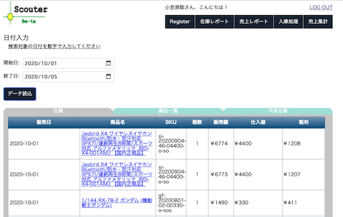

# ECサイト Bi-Scouter(在庫管理ツール)

### 概要
* 制作期間： 14日間
* 使用技術： HTML,CSS,JS,Laravel,MySQL,GoogleSheetAPI
* プロダクト紹介映像: https://youtu.be/xwcmHFuv7Jo

[棚卸しツール](https://github.com/worldwideweb13/stock-cal)をバージョンアップしたもの。
ECサイト運営者向けの売上／在庫管理ツールを作成しました。本アプリではGoogleスプレッドシート、CSVファイルからデータを取り込み、売上集計、在庫管理機能を提供します。

### 実行環境
* php 7.4.2
* MySql 5.7.26
* MAMP推奨
* 事前にGoogleSheetAPIを有効化しておく必要があります。[credentials.json](https://github.com/worldwideweb13/Bi-Scouter/blob/b16eddf92b9f48a0b005e68a98b30c68e5300d14/credentials.json)に自身のSheetAPI情報を設定してください。  Google Spreadsheet APIを使うには、Google API コンソールで有効にする必要があります。詳細は下記の記事が参考になるので確認ください。

[Laravel で注文データをGoogleスプレッドシートに追加する](https://blog.capilano-fw.com/?p=1816)
上記の記事の"Google APIでスプレッドシートを有効にする"の項を参考

DBは[gs_db.sql](gs_db.sql)をMySqlにインポートして下さい。テストデータが既に含まれているデータファルになります。
アプリの利用手順は以下になります。(※　sqlデータには全てのデータがセットされているため、スプレッドシート、csvファイルの読み込みは不要です)
1. ログイン([実行環境/php/login.php](php/login.php))後、GoogleSpreadシートからデータを取り込み
2. Top画面にて取り込まれたデータ確認、在庫編集機能の利用
3. CSVファイルから売上データ取り込み
4. 売上集計機能から開始と終了日付を入力すると、期間内の売上データが閲覧。

### 開発の苦労した点
一つのシート(csv,スプレッドシート)からデータ分割をして、複数テーブルに同時にデータを流し込む作業に苦労しました。商品、在庫、入金処理テーブルetcとデータ属性毎にテーブルを分割したため、１ファイルを読み込んだ際に発行されるSQL文が複雑化したため、エラーなくデータ属性毎にDBテーブルの振り分けを処理するロジックを実装するのに苦労しました。また、売上集計機能実装時に非同期処理を利用したため、一連の流れをバニラのphp,JSで書き込むのに苦労しました。反面、DBテーブル更新処理や非同期処理に関しての基礎理解が深まり、大変勉強になりました。以降はフレームワーク（Laravel）を利用した実践的な開発に着手します。
